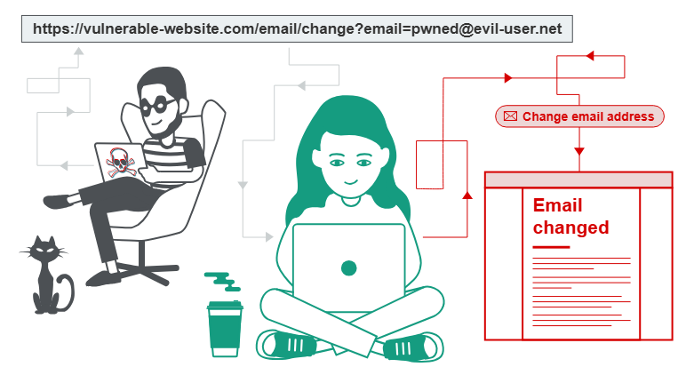

# Cross-Site Request Forgery (CSRF)

- ***Cross-site request forgery*** (abbreviated **CSRF** or **XSRF** ) attacks occur when unauthorized commands are transmitted from a user who is trusted by an application.
- CSRF attacks are different from XSS attacks because they exploit the trust that an application has in a user’s browser.
- CSRF is a web security vulnerability that allows an attacker to induce users to perform actions that they do not intend to perform. It allows an attacker to partly circumvent the same origin policy, which is designed to prevent different websites from interfering with each other.

**NOTE** CSRF vulnerabilities are also referred to as *one-click attacks* or *session riding*.

- CSRF attacks typically affect applications (or websites) that rely on a user’s identity.
- Attackers can trick the user’s browser into sending HTTP requests to a target website.
- An example of a CSRF attack is a user authenticated by the application through a cookie saved in the browser unwittingly sending an HTTP request to a site that trusts the user, subsequently triggering an unwanted action.



For a CSRF attack to be possible, three key conditions must be in place:

- **A relevant action.** There is an action within the application that the attacker has a reason to induce. This might be a privileged action (such as modifying permissions for other users) or any action on user-specific data (such as changing the user's own password).
- **Cookie-based session handling.** Performing the action involves issuing one or more HTTP requests, and the application relies solely on session cookies to identify the user who has made the requests. There is no other mechanism in place for tracking sessions or validating user requests.
- **No unpredictable request parameters.** The requests that perform the action do not contain any parameters whose values the attacker cannot determine or guess. For example, when causing a user to change their password, the function is not vulnerable if an attacker needs to know the value of the existing password.

For example, suppose an application contains a function that lets the user change the email address on their account. When a user performs this action, they make an HTTP request like the following:

```
POST /email/change HTTP/1.1
Host: vulnerable-website.com
Content-Type: application/x-www-form-urlencoded
Content-Length: 30
Cookie: session=yvthwsztyeQkAPzeQ5gHgTvlyxHfsAfE

email=wiener@normal-user.com
```

This meets the conditions required for CSRF:

- The action of changing the email address on a user's account is of interest to an attacker. Following this action, the attacker will typically be able to trigger a password reset and take full control of the user's account.
- The application uses a session cookie to identify which user issued the request. There are no other tokens or mechanisms in place to track user sessions.
- The attacker can easily determine the values of the request parameters that are needed to perform the action.

With these conditions in place, the attacker can construct a web page containing the following HTML:

```
<html>
    <body>
        <form action="https://vulnerable-website.com/email/change" method="POST">
            <input type="hidden" name="email" value="pwned@evil-user.net" />
        </form>
        <script>
            document.forms[0].submit();
        </script>
    </body>
</html>
```

If a victim user visits the attacker's web page, the following will happen:

- The attacker's page will trigger an HTTP request to the vulnerable website.
- If the user is logged in to the vulnerable website, their browser will automatically include their session cookie in the request (assuming SameSite cookies are not being used).
- The vulnerable website will process the request in the normal way, treat it as having been made by the victim user, and change their email address.

**NOTE:** Although CSRF is normally described in relation to cookie-based session handling, it also arises in other contexts where the application automatically adds some user credentials to requests, such as HTTP Basic authentication and certificate-based authentication.

---

## **How to deliver a CSRF exploit**

The delivery mechanisms for cross-site request forgery attacks are essentially the same as for reflected XSS. Typically, the attacker will place the malicious HTML onto a website that they control, and then induce victims to visit that website. This might be done by feeding the user a link to the website, via an email or social media message. Or if the attack is placed into a popular website (for example, in a user comment), they might just wait for users to visit the website.

Note that some simple CSRF exploits employ the GET method and can be fully self-contained with a single URL on the vulnerable website. In this situation, the attacker may not need to employ an external site, and can directly feed victims a malicious URL on the vulnerable domain. In the preceding example, if the request to change email address can be performed with the GET method, then a self-contained attack would look like this:

```

```

---

## **What is the difference between XSS and CSRF?**

Cross-Site Scripting (or XSS) allows an attacker to execute arbitrary JavaScript within the browser of a victim user.

Cross-Site Request Forgery (or CSRF) allows an attacker to induce a victim user to perform actions that they do not intend to.

The consequences of XSS vulnerabilities are generally more serious than for CSRF vulnerabilities:

- CSRF often only applies to a subset of actions that a user is able to perform. Many applications implement CSRF defenses in general but overlook one or two actions that are left exposed. Conversely, a successful XSS exploit can normally induce a user to perform any action that the user is able to perform, regardless of the functionality in which the vulnerability arises.
- CSRF can be described as a "one-way" vulnerability, in that while an attacker can induce the victim to issue an HTTP request, they cannot retrieve the response from that request. Conversely, XSS is "two-way", in that the attacker's injected script can issue arbitrary requests, read the responses, and exfiltrate data to an external domain of the attacker's choosing.

---

## **Common defences against CSRF**

Nowadays, successfully finding and exploiting CSRF vulnerabilities often involves bypassing anti-CSRF measures deployed by the target website, the victim's browser, or both. The most common defenses you'll encounter are as follows:

- **CSRF tokens** - A CSRF token is a unique, secret, and unpredictable value that is generated by the server-side application and shared with the client. When attempting to perform a sensitive action, such as submitting a form, the client must include the correct CSRF token in the request. This makes it very difficult for an attacker to construct a valid request on behalf of the victim.
- **SameSite cookies** - SameSite is a browser security mechanism that determines when a website's cookies are included in requests originating from other websites. As requests to perform sensitive actions typically require an authenticated session cookie, the appropriate SameSite restrictions may prevent an attacker from triggering these actions cross-site. Since 2021, Chrome enforces `Lax` SameSite restrictions by default. As this is the proposed standard, we expect other major browsers to adopt this behavior in future.
- **Referer-based validation** - Some applications make use of the HTTP Referer header to attempt to defend against CSRF attacks, normally by verifying that the request originated from the application's own domain. This is generally less effective than CSRF token validation.

---

## Useful Links

### Labs

Bypassing CSRF token validation:

- [https://portswigger.net/web-security/csrf/bypassing-token-validation](https://portswigger.net/web-security/csrf/bypassing-token-validation)

Bypassing SameSite cookie restrictions:

- [https://portswigger.net/web-security/csrf/bypassing-samesite-restrictions](https://portswigger.net/web-security/csrf/bypassing-samesite-restrictions)

Bypassing Referer-based CSRF defenses:

- [https://portswigger.net/web-security/csrf/bypassing-referer-based-defenses](https://portswigger.net/web-security/csrf/bypassing-referer-based-defenses)

### Practical Resources

- [https://medium.com/@L1lith/cross-site-request-forgery-csrf-cheat-sheet-a4b3d07ed860](https://medium.com/@L1lith/cross-site-request-forgery-csrf-cheat-sheet-a4b3d07ed860)
- [https://github.com/swisskyrepo/PayloadsAllTheThings/blob/master/Cross-Site Request Forgery/README.md](https://github.com/swisskyrepo/PayloadsAllTheThings/blob/master/Cross-Site%20Request%20Forgery/README.md)