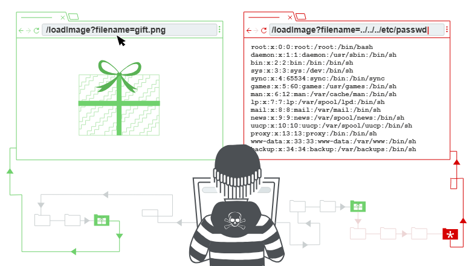

# Directory Traversal

A ***directory traversal*** vulnerability (often referred to as path traversal ) can allow attackers to access files and directories that are stored outside the web root folder.



**NOTE** Directory traversal has many names, including *dot-dot-slash*, *directory climbing*, and *backtracking*.

- It is possible to exploit path traversal vulnerabilities by manipulating variables that reference files with the dot-dot-slash ( ../ ) sequence and its variations or by using absolute file paths to access files on the vulnerable system.

This attack enables an attacker to read arbitrary files on the server that is running an application. This might include:

- Application code and data.
- Credentials for back-end systems.
- Sensitive operating system files.

An example payload URL could look like: 

```jsx
http://192.168.78.8:66/vulnerabilities/fi/?page=../../../../../etc/passwd
```

The vulnerable application shows the contents of the **/etc/passwd** file to the attacker.

It is possible to use URL encoding, as demonstrated in the following example to exploit directory (path) traversal vulnerabilities:

```jsx
%2e%2e%2f is the same as ../

%2e%2e/ is the same as ../

..%2f is the same as ../

%2e%2e%5c is the same as ..\
```

An attacker can also use several other combinations of encoding – for example, operating system-specific path structures such as **/** in Linux or macOS systems and **\** in Windows.

---

## **Reading arbitrary files via path traversal**

Imagine a shopping application that displays images of items for sale. This might load an image using the following HTML:

```

```

The `loadImage` URL takes a `filename` parameter and returns the contents of the specified file. The image files are stored on disk in the location `/var/www/images/`. To return an image, the application appends the requested filename to this base directory and uses a filesystem API to read the contents of the file. In other words, the application reads from the following file path:

```
/var/www/images/218.png
```

This application implements no defenses against path traversal attacks. As a result, an attacker can request the following URL to retrieve the `/etc/passwd` file from the server's filesystem:

```
https://insecure-website.com/loadImage?filename=../../../etc/passwd
```

This causes the application to read from the following file path:

```
/var/www/images/../../../etc/passwd
```

The sequence `../` is valid within a file path, and means to step up one level in the directory structure. The three consecutive `../` sequences step up from `/var/www/images/` to the filesystem root, and so the file that is actually read is:

```
/etc/passwd
```

On Unix-based operating systems, this is a standard file containing details of the users that are registered on the server, but an attacker could retrieve other arbitrary files using the same technique.

On Windows, both `../` and `..\` are valid directory traversal sequences. The following is an example of an equivalent attack against a Windows-based server:

```
https://insecure-website.com/loadImage?filename=..\..\..\windows\win.ini
```

---

## Useful Links

- [https://github.com/swisskyrepo/PayloadsAllTheThings/blob/master/Directory Traversal/README.md](https://github.com/swisskyrepo/PayloadsAllTheThings/blob/master/Directory%20Traversal/README.md)
- [https://gist.github.com/OblivionDev/4eac73e9a28fc28a9679](https://gist.github.com/OblivionDev/4eac73e9a28fc28a9679)
- [https://securifyai.co/learnings/automating-path-traversal-detection-in-client-side-code-enhancing-security-and-efficiency/](https://securifyai.co/learnings/automating-path-traversal-detection-in-client-side-code-enhancing-security-and-efficiency/)