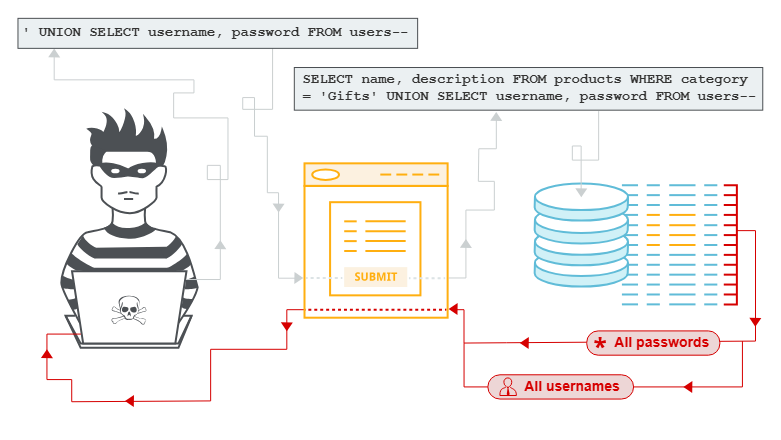

# SQL Injection (SQLI)

### What is it?

SQL injection, also known as SQLI, is **a common attack vector that uses malicious SQL code for backend database manipulation to access information that was not intended to be displayed**.



- ***SQL injection (SQLi)*** vulnerabilities can be catastrophic because they can allow an attacker to view, insert, delete, or modify records in a database.
- In injection attack, the attacker inserts, or injects, partial or complete SQL queries via the web application.
- The attacker injects SQL commands into input fields in an application or a URL in order to execute predefined SQL commands.

The most **common SQL statements** (commands) include:

- **SELECT**: Used to obtain data from a database
- **UPDATE**: Used to update data in a database
- **DELETE**: Used to delete data from a database
- **INSERT INTO**: Used to insert new data into a database
- **CREATE DATABASE**: Used to create a new database
- **ALTER DATABASE**: Used to modify a database
- **CREATE TABLE**: Used to create a new table
- **ALTER TABLE**: Used to modify a table
- **DROP TABLE**: Used to delete a table
- **CREATE INDEX**: Used to create an index or a search key element
- **DROP INDEX**: Used to delete an index

---

## Practical Resources

- [https://portswigger.net/web-security/sql-injection/cheat-sheet](https://portswigger.net/web-security/sql-injection/cheat-sheet)
- [https://github.com/swisskyrepo/PayloadsAllTheThings/blob/master/SQL Injection/MySQL Injection.md](https://github.com/swisskyrepo/PayloadsAllTheThings/blob/master/SQL%20Injection/MySQL%20Injection.md)
- [https://github.com/kleiton0x00/Advanced-SQL-Injection-Cheatsheet](https://github.com/kleiton0x00/Advanced-SQL-Injection-Cheatsheet)
- [https://hackertarget.com/sqlmap-tutorial/](https://hackertarget.com/sqlmap-tutorial/)

---

## Basic Queries

In this case, an attacker can log in as any user without the need for a password. They can do this using the SQL comment sequence `--` to remove the password check from the `WHERE` clause of the query. For example, submitting the username `administrator'--` and a blank password results in the following query:

```
SELECT * FROM users WHERE username = 'administrator'--' AND password = ''
```

This query returns the user whose `username` is `administrator` and successfully logs the attacker in as that user.

### Retrieving data from other database tables

In cases where the application responds with the results of a SQL query, an attacker can use a SQL injection vulnerability to retrieve data from other tables within the database. You can use the `UNION` keyword to execute an additional `SELECT` query and append the results to the original query.

For example, if an application executes the following query containing the user input `Gifts`:

```
SELECT name, description FROM products WHERE category = 'Gifts'
```

An attacker can submit the input:

```
' UNION SELECT username, password FROM users--
```


Example of a Basic SQL Injection Attack Numeric-Based User Input

There are essentially five techniques that can be used to exploit SQL injection vulnerabilities:

- **Union operator**: This is typically used when an SQL injection vulnerability allows a**SELECT** statement to combine two queries into a single result or a set of results.
- **Boolean**: This is used to verify whether certain conditions are true or false.
- **Error-based technique**: This is used to force the database to generate an error in order toenhance and refine an attack (injection).
- **Out-of-band technique**: This is typically used to obtain records from the database byusing a different channel. For example, it is possible to make an HTTP connection to sendthe results to a different web server or a local machine running a web service.
- **Time delay**: It is possible to use database commands to delay answers. An attacker mayuse this technique when he or she doesn’t get output or error messages from theapplication.

**The UNION Exploitation Technique**

- The SQL UNION operator is used to combine the result sets of two or more SELECT statements, as shown here:

```jsx
SELECT zipcode FROM h4cker_customers

UNION

SELECT zipcode FROM h4cker_suppliers;
```

By default, the UNION operator selects only distinct values. You can use the UNION ALL operator if you want to allow duplicate values.

- Attackers may use the **UNION** operator in SQL injections attacks to join queries.
- The main goal of this strategy is to obtain the values of columns of other tables.
- The following is an example of a UNION -based SQL injection attack:

```jsx
SELECT zipcode FROM h4cker_customers WHERE zip=1 UNION ALL

SELECT creditcard FROM payments
```

In this example, the attacker joins the result of the original query with all the credit card numbers in the payments table.


Example of a UNION Operand in an SQL Injection Attack

The following is an example of a **UNION**-based SQL injection attack using a URL:

```jsx
https://store.h4cker.org/buyme.php?id=1234' UNION SELECT 1,user_name,password,'1','1','1',1 FROM user_system_data --
```

---

## Blind SQL Injection Attacks

Blind SQL injection occurs when an application is vulnerable to SQL injection, but its HTTP responses do not contain the results of the relevant SQL query or the details of any database errors.

Many techniques such as [`UNION` attacks](https://portswigger.net/web-security/sql-injection/union-attacks) are not effective with blind SQL injection vulnerabilities. This is because they rely on being able to see the results of the injected query within the application's responses. It is still possible to exploit blind SQL injection to access unauthorized data, but different techniques must be used.

### Exploiting blind SQL injection by triggering time delays

If the application catches database errors when the SQL query is executed and handles them gracefully, there won't be any difference in the application's response. This means the previous technique for inducing conditional errors will not work.

In this situation, it is often possible to exploit the blind SQL injection vulnerability by triggering time delays depending on whether an injected condition is true or false. As SQL queries are normally processed synchronously by the application, delaying the execution of a SQL query also delays the HTTP response. This allows you to determine the truth of the injected condition based on the time taken to receive the HTTP response.

The techniques for triggering a time delay are specific to the type of database being used. For example, on Microsoft SQL Server, you can use the following to test a condition and trigger a delay depending on whether the expression is true:

```
'; IF (1=2) WAITFOR DELAY '0:0:10'--
'; IF (1=1) WAITFOR DELAY '0:0:10'--
```

- The first of these inputs does not trigger a delay, because the condition `1=2` is false.
- The second input triggers a delay of 10 seconds, because the condition `1=1` is true.

Using this technique, we can retrieve data by testing one character at a time:

```
'; IF (SELECT COUNT(Username) FROM Users WHERE Username = 'Administrator' AND SUBSTRING(Password, 1, 1) > 'm') = 1 WAITFOR DELAY '0:0:{delay}'--
```


Example of a Blind SQL Injection Attack

---

### Stacked Queries

- In a normal SQL query, you can use a semicolon to specify that the end of a statement has been reached and what follows is a new one.
- This technique allows you to execute multiple statements in the same call to the database.
- UNION queries used in SQL injection attacks are limited to SELECT statements.
- However, stacked queries can be used to execute any SQL statement or procedure.
- A typical attack using this technique could specify a malicious input statement such as the following:

```jsx
1; DELETE FROM customers
```

The vulnerable application and database process this statement as the following SQL query:

```jsx
SELECT * FROM customers WHERE customer_id=1; DELETE FROM customers
```

---

**The Time-Delay SQL Injection Technique**

- When trying to exploit a blind SQL injection, the Boolean technique is very helpful.
- Another trick is to also induce a delay in the response, which indicates that the result of the conditional query is true.

**NOTE** The time-delay technique varies from one database type/vendor to another.

The following is an example of using the time-delay technique against a MySQL server:

```jsx
https://store.h4cker.org/buyme.php?id=8 AND IF(version() like '8%', sleep(10), 'false'))--
```

- In this example, the query checks whether the MySQL version is 8.x and then forces the server to delay the answer by 10 seconds.
- The attacker can increase the delay time and monitor the responses.
- The attacker could even set the sleep parameter to a high value since it is not necessary to wait that long and then just cancel the request after a few seconds.

---

## SQLMap

Sqlmap is an open source penetration testing tool that automates the process of detecting and exploiting SQL injection flaws and taking over of database servers. It comes with a powerful detection engine, many niche features for the ultimate penetration tester and a broad range of switches lasting from database fingerprinting, over data fetching from the database, to accessing the underlying file system and executing commands on the operating system via out-of-band connections.


example sqlmap input